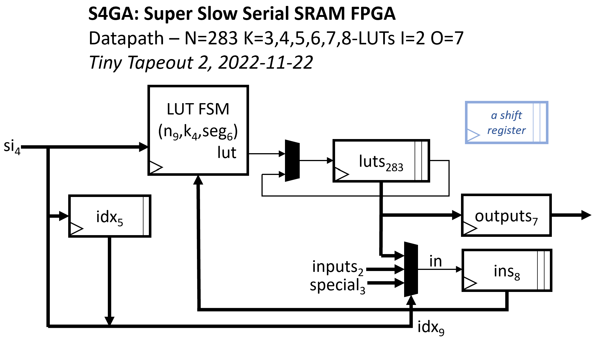

  

# S4GA: Super Slow Serial SRAM FPGA for Tiny Tapeout 3

This is a copy for Tiny Tapeout 3 of a design that was submitted for Tiny Tapeout 2.
I report below the original wiki.

## ASIC implementation

[Explore the GDS 3D view](https://bat52.github.io/tt03-s4ga).
# S4GA: Super Slow Serial SRAM FPGA for Tiny Tapeout 2

This is the Tiny Tapeout 2 Super Slow Serial SRAM FPGA, S4GA, the best
FPGA I could implement in ~150x170um of the 130nm Skywater ASIC PDK.

This version of S4GA uses an external serial SRAM with SQI (QSPI) mode
such as the Microchip 23LC512 to continually stream in 4-bit segments
of the LUTs' config data into the device.

While the LUT configuration data is streamed in from external SRAM,
the current LUT output values are kept on-die.

As a circuit area optimization, the LUT outputs circular shift register
'luts' shifts every cycle, but LUT evaluation occurs every LL = K *
($clog2(N)+3)/4 + 2^K/4 cycles.  So within the shift register, subsequent
LUT output values are not continuous but permuted, each staggered by LL
positions, interleaved and wrapping around.

To register the last N outputs without overwriting earlier ones, this
requires GCD(N,LL)=1. Best to make N prime.

A given LUT output's index increments / wraps around to 0, each cycle.
Therefore LUT outputs' LUT input indices in the configuration bitstream
must compensate for these shenanigans.

The project is currently configured to repeatedly evaluate N=283 K=5-LUTs with LL=23 cycles.
Each LUT configuration has this format:

    // LUT config:
    struct LUT { // all fields big-endian, most signif. nybble first:
        bit[12] in4;    // index of LUT input 4, in [0,3+I+N)
        bit[12] in3;    // index of LUT input 3, in [0,3+I+N)
        bit[12] in2;    // index of LUT input 2, in [0,3+I+N)
        bit[12] in1;    // index of LUT input 1, in [0,3+I+N)
        bit[12] in0;    // index of LUT input 0, in [0,3+I+N)
        bit[32] mask;   // 5-LUT truth table
    };

## Ripple carry LUT optimization

While evaluating each K-LUT, S4GA also evaluates the LUT's lower half-LUT
mask using the K-1 inputs in[0],...,in[K-2], into the 'Q' register.
This enables efficient ripple carry adders, using the upper half-LUT
to evaluate sum[i] and the lower half-LUT to evaluate the carry[i],
fed into the next LUT (via Q).

## I/Os

Parameter I is the number of FPGA input signals. Currently I=2.

Parameter O is the number of FPGA outputs. Currently O=7.

The last O LUT outputs are copied to the io_out[6:0] output register,
in each cycle in which evaluation of all of the N K-LUTs completes.
On reset, io_out[6:0] is '0.

## Special LUT input indices: 

The first 3 + I LUT input indices encode special inputs and FPGA input signals.
    0       => LUT input is constant 0
    1       => LUT input is constant 1
    2       => LUT input is Q
    3       => FPGA input #0
    ...     => ...
    2+I     => FPGA input #I-1
    3+I     => a recent LUT output
    ...     => ...
    2+I+N   => a recent LUT output
    etc.

## Pinout

All inputs are synchronous to clk.
All outputs switch on clk and switch in the same cycle.

    Pin         Signal  Description
    io_in[0]    clk     external clock
    io_in[1]    rst     +ve sync reset
    io_in[2]    si[0]   LUT configuration lsb
    io_in[3]    si[1]   LUT configuration bit
    io_in[4]    si[2]   LUT configuration bit
    io_in[5]    si[3]   LUT configuration msb
    io_in[6]    in[0]   input 0 => LUT 0
    io_in[7]    in[1]   input 1 => LUT 1
    io_out[0]   out[0]  output 0 <= LUT N-I+0
    io_out[1]   out[1]  output 1 <= LUT N-I+1
    io_out[2]   out[2]  output 2 <= LUT N-I+2
    io_out[3]   out[3]  output 3 <= LUT N-I+3
    io_out[4]   out[4]  output 4 <= LUT N-I+4
    io_out[5]   out[5]  output 5 <= LUT N-I+5
    io_out[6]   out[6]  output 6 <= LUT N-I+6
    io_out[7]   debug   debug: evaluated LUT input values, LUT output values

## Block diagram

## See also

See also my prior [Zero-to-ASIC S4GA repo](https://github.com/grayresearch/s4ga).

## TODO

1. Implement yosys + bitgen based flow Verilog => configuration bitstream

_More soon_.

Copyright (C) 2022, Gray Research LLC.
Licensed under the Apache License, Version 2.0.

  

# What is Tiny Tapeout?

TinyTapeout is an educational project that aims to make it easier and cheaper than ever to get your digital designs manufactured on a real chip!

Go to https://tinytapeout.com for instructions!

## How to change the Wokwi project

Edit the [info.yaml](info.yaml) and change the wokwi_id to match your project.

## How to enable the GitHub actions to build the ASIC files

Please see the instructions for:

* [Enabling GitHub Actions](https://tinytapeout.com/faq/#when-i-commit-my-change-the-gds-action-isnt-running)
* [Enabling GitHub Pages](https://tinytapeout.com/faq/#my-github-action-is-failing-on-the-pages-part)

## How does it work?

When you edit the info.yaml to choose a different ID, the [GitHub Action](.github/workflows/gds.yaml) will fetch the digital netlist of your design from Wokwi.

After that, the action uses the open source ASIC tool called [OpenLane](https://www.zerotoasiccourse.com/terminology/openlane/) to build the files needed to fabricate an ASIC.

## Resources

* [FAQ](https://tinytapeout.com/faq/)
* [Digital design lessons](https://tinytapeout.com/digital_design/)
* [Learn how semiconductors work](https://tinytapeout.com/siliwiz/)
* [Join the community](https://discord.gg/rPK2nSjxy8)

## What next?

* Share your GDS on Twitter, tag it [#tinytapeout](https://twitter.com/hashtag/tinytapeout?src=hashtag_click) and [link me](https://twitter.com/matthewvenn)!
